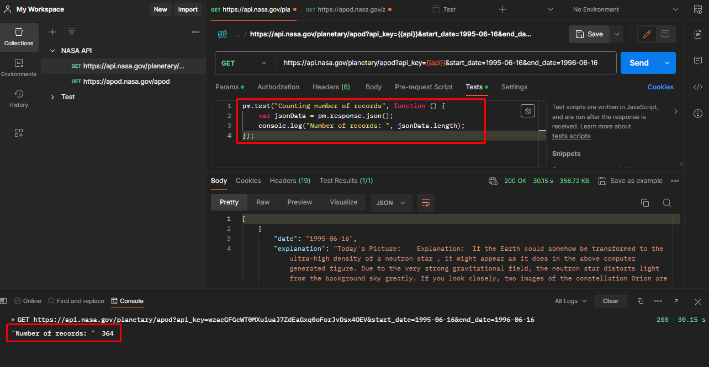

# Задание 1

Используя браузер Google Chrome, перейдите на сайт https://ylab.io/

- Определите первый HTTPS-запрос, отправленный к домену ylab.io. В ответе укажите стартовую строку данного запроса.

**Стартовая строка первого запроса: GET https://ylab.io HTTP/2**


- У вкладки “О компании” (https://drive.google.com/file/d/1fSPgT9usn6gEBGcQcnKaBlcWuJkBI-88/view?usp=sharing) определите цвет используемого шрифта. В
  ответе укажите его в формате r,g,b.

**Цвет данного элемента - rgb(10 184 182)**


# Задание 2

Для API https://api.nasa.gov/planetary/apod

- Определите минимально возможное валидное значение параметра date. В ответе укажите его в формате YYYY-MM-DD.

**При запросе `GET https://api.nasa.gov/planetary/apod?api_key={{api}}&date=1970-01-01` в теле ответа было получено
сообщение: `"Date must be between Jun 16, 1995 and Mar 02, 2024."`. Соответственно, минимальное валидное значение date будет 1995-06-16.**
*Переменная `api` содержит полученный мной API key.*


- Укажите количество записей, возвращаемых в ответе на запрос к указанному API, за период, начало которого - это ответ из пункта 1 данной задачи, а
  конец - 16 июня 1996 года.

**С помощью запроса `https://api.nasa.gov/planetary/apod?api_key={{api}}&start_date=1995-06-16&end_date=1996-06-16` и скрипта во вкладке Tests:**

```js
pm.test("Counting number of records", function () {
    var jsonData = pm.response.json();
    console.log("Number of records: ", jsonData.length);
});
```

**я нашла записи с 16 июня 1995 по 16 июня 1996. Всего записей в ответе - 364.**



# Задание 3

К какому виду идентификаторов ресурсов в сети относится `https://www.yandex.ru/search/?text=test`?

**Данная строка относится к URI и включает в себя:<br>
Протокол `https://`<br>
Доменное имя `www.yandex.ru`<br>
Путь к ресурсу `/search/`<br>
Параметры запроса `?text=test`**

# Задание 4

Верно ли утверждение, что структура HTTP-запроса равна структуре HTTP-ответа?

**Структура HTTP-ответа равна структуре HTTP-запроса: стартовая строка, заголовки, пустая строка и опционально тело. Однако, содержание запросов и
ответов различается. Например, стартовая строка у запроса и ответа всегда будет отличаться. Также могут отличаться заголовки и их может быть
разное количество. Также возможно такое, что запрос не будет содержать тело, но в ответе оно будет присутствовать.**

# Задание 5

Должен ли http-ответ содержать заголовок Host?

**Нет, ответ не содержит заголовок Host. Данный заголовок должен содержать запрос при версии HTTP/1.1, причем он должен быть только один. Если
заголовок Host не будет включен в запрос или их будет больше одного, в ответе мы получим ошибку с кодом 400.**